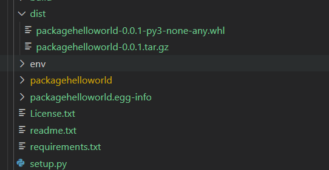
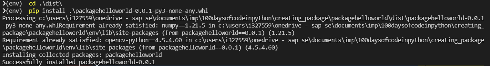
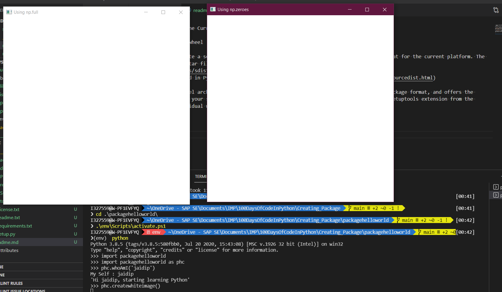

- Command to make wheel of the Current Package
```python
python setup.py sdist bdist_wheel
```
1. `sdist` : command to create a source distribution, sdist creates the archive of the default format for the current platform. The default format is a gzip’ed tar file (.tar.gz) on Unix, and ZIP file on Windows.

More Information can be found in Python Documentation, [here](https://docs.python.org/3/distutils/sourcedist.html)

2. `bdist_wheel` : Build Wheel archives for your requirements and dependencies. Wheel is a built-package format, and offers the advantage of not recompiling your software during every install. 'pip wheel' uses the bdist_wheel setuptools extension from the wheel package to build individual wheels.

---

- After doing the installation of the generated wheel, 

Importing the module was succsessfull, 
